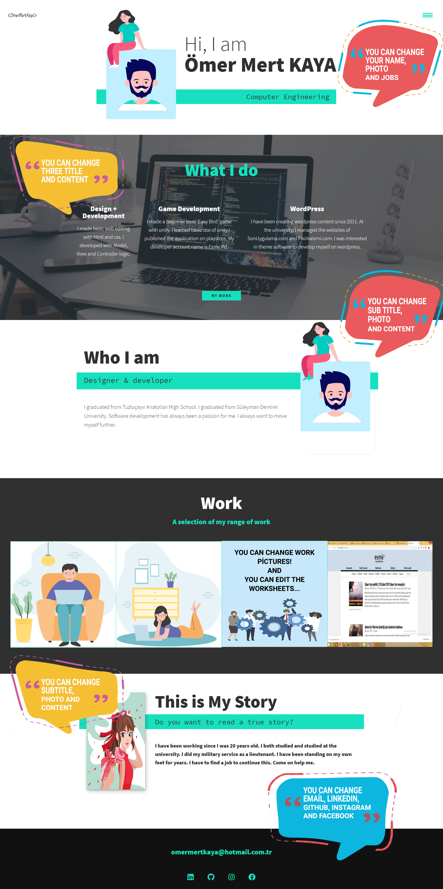

# PORTFOLIO WITH DJANGO

- Front-end coding was done with html vs css.
- Javascript is used in the upper left menu.
- In the Back-End section, development was made with django.

# Do you want to preview my portfolio?

- https://omermertkaya.herokuapp.com/

# Do you want to browse the admin panel?

- https://omermertkaya.herokuapp.com/admin/login/?next=/admin/
- Username : testuser
- Password : DjangoAdmin123


# Installation for Windows;


1) Open "cmd" in project file,

```
cd virt
cd scripts
activate
```

2) Return to project file

```
cd ../
cd ../
```

3) Run server
```
python manage.py runserver
```


# Preview




# Source


You can [review](https://www.youtube.com/watch?v=_xkSvufmjEs&ab_channel=freeCodeCamp.org) the page for front-end.

You can look [documentation](https://docs.djangoproject.com/en/3.1/) django for back-end.


